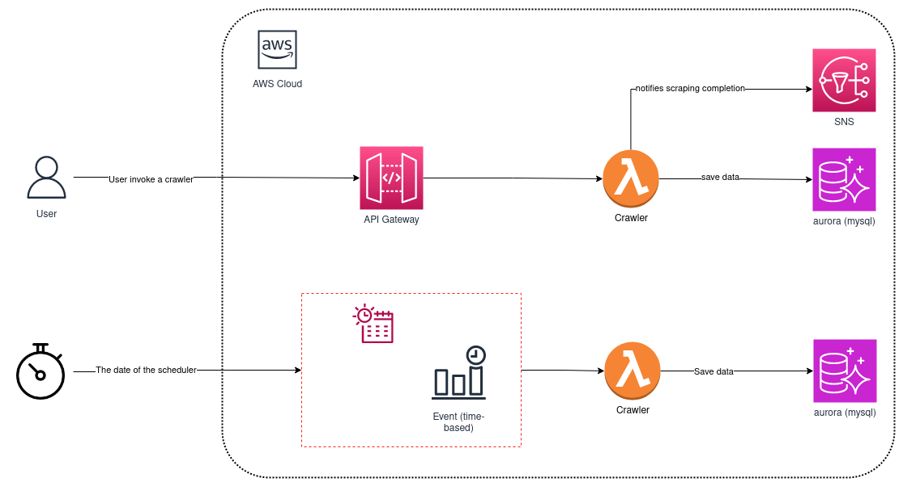

<h1 align="center">
   Crawler bpsaude
</h1>

  
  
  
  

  <a href="#question-about">About</a>&nbsp;&nbsp;&nbsp;|&nbsp;&nbsp;&nbsp;
  <a href="#gear-technologies">Technologies</a>&nbsp;&nbsp;&nbsp;|&nbsp;&nbsp;&nbsp;
  <a href="#rocket-getting-started">How to test</a>&nbsp;&nbsp;&nbsp;

# Sugestão de arquitetura:

      

- Lambda: Destinado a hospedar a aplicação responsável pela execução da raspagem de dados.
- API Gateway: Utilizado para expor o Lambda na web através de uma estrutura de API.
- SNS: Empregado para comunicar outras aplicações ou sistemas sobre a conclusão da raspagem, se necessário.
- EventBridge (Scheduler): Usado para agendar as execuções do Lambda. Pode ser configurado como parte da infraestrutura (IAC) ou, se necessário, pode-se criar um endpoint (API Gateway + Lambda) para gerenciar o agendamento na AWS.
- Aurora: Banco de dados designado para ser populado pelo crawler.

[Exemplo de estrutura no terraform para lambda](https://github.com/OtavioBernardes/lambda-notifier/tree/main/terraform)

## :question: About
### Por que utilizar uma função lambda para o crawler?
O uso de funções Lambda para implementar crawlers oferece uma serie de benefícios, dentre eles:
  - Custo eficiente: Não é necessário manter servidores permanentemente em execução, o que é especialmente vantajoso para crawlers executados em períodos específicos do dia.
  - As funções Lambda são totalmente gerenciadas pela AWS e escalam automaticamente de acordo com a carga de trabalho.
  - Monitoramento: Fácil monitoramento e registro de atividades através do CloudWatch, facilitando a depuração e otimização da aplicação.
  - Integração com outros serviços: Facilidade de integração com diversos serviços da AWS, como mensageria, filas e bancos de dados.

Em resumo, usar funções Lambda para implementar crawlers na AWS proporciona uma abordagem eficiente, escalável e fácil de gerenciar para lidar com tarefas que podem variar em termos de carga de trabalho e demanda.
### Como seria o deploy dessa estrutura?
Para implementar o deploy desta infraestrutura, adotaria o Terraform como ferramenta principal para gerenciar a infraestrutura como código (IAC), garantindo que toda a arquitetura seja versionada e facilmente replicável. Posteriormente, integraria o Jenkins para estabelecer um pipeline de deploy eficiente.

O processo incluiria as seguintes etapas:
- Gestão da Infraestrutura com Terraform: *utilizaria o Terraform para definir a infraestrutura como código, descrevendo os recursos necessários na AWS. Isso incluiria a configuração das funções Lambda, permissões, e quaisquer outros recursos envolvidos.*
- Pipeline de Deploy com Jenkins: *configuraria um pipeline de deploy no Jenkins para automatizar o processo de implantação. Este pipeline seria acionado por eventos como commits no repositório ou manualmente.*

- Automatização do Deploy: *integraria comandos Terraform no pipeline Jenkins para aplicar as alterações na infraestrutura. Isso garantiria que as atualizações sejam realizadas de maneira consistente e controlada.*

- Variáveis de Ambiente: *consideraria a utilização uma ferramenta de gestão de variáveis de ambiente, como Vault, para garantir a segurança e o gerenciamento eficaz de segredos e informações sensíveis.*

- Notificações e Feedback: *configuraria notificações no Jenkins para alertar sobre o status do deploy, seja ele bem-sucedido ou com falhas.*

Ao seguir esse processo, a implantação da infraestrutura seria automatizada, rastreável e segura. A integração do Terraform com o Jenkins possibilita um fluxo de trabalho contínuo e eficiente, enquanto ferramentas adicionais, como o Vault, contribuem para a gestão segura das variáveis de ambiente.

## :gear: Technologies

**These are the technologies that I used to develop this application:**  
⌨️ <strong>Typescript</strong> —> Typescript  
⚙️ <strong>AWS</strong> —> Amazom Web Services 

## :rocket: How to test

1. Clone esse repositorio: `git clone https://github.com/OtavioBernardes/crawler-bpsaude`.
2. Instale as dependencias: `npm ci`.
3. Altere o nome do `.sample.env` para `.env`.
4. Inicialize o banco de dados `docker compose -f development/docker-compose.yml up`.
4. Rode os casos de testes: `npm run test`.
5. Acesse `http://localhost:8080` para visualizar as informações no banco de dados. Senha: `fakepassword`

### Caso deseje buscar os planos de um cliente especifico em tempo real, siga os passos abaixo, pois os testes do arquivo `index.test.ts` estão mockados:
1. Siga ate o 4° passo citado acima.
2. Altere o clienteName no arquivo `test/manual.test.ts`.
3. Rode o teste manual com o comando `npm run test:manual`.
4. Acesse `http://localhost:8080` para visualizar as informações no banco de dados.
